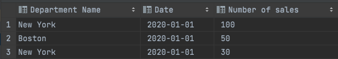
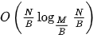

# Backend Engineer Test

<h3>How to install </h3>

```
git clone https://github.com/Ihor-Kalhanov-Uvik/backend-engineer-test-data.git

cd backend-engineer-test-data/

pip install virtualenv

virtualenv venv
````
For Mac OS / Linux
```
source venv/bin/activate
````

For Windows
```
venv\Scripts\activate
````

Install requirements
```
 pip install -r requirements.txt 
````


<h3>How it work</h3>
* Create or write your data to a file: 'data.csv' (`it is important`)


* Run python script `main.py`
* After working the program you will see a new file in which the result of the task


<p>Before working with our data, we prepare it. We sort all our data by "Department Name", as each of our fields has this data. Then we start processing data.  
 Since the names are already sorted, we follow the name change, as soon as there is a change, we write it into the output file with calculated sum.</p>


<h3>Complexity of the algorithm</h3>
The most complex is the first step of soritng intial file. To do this we use external lib which handles "externa sorting" approach for us.
 It's a known problem and it has complexity according to 


 https://en.wikipedia.org/wiki/External_sorting.
 Once file is sorted all we have to do is to scan through file and properly count sum for each departmnet which roghly gets us to additianl  4N opertions to create output file.
