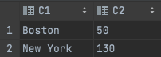

# Backend Engineer Test

<h3>How to install </h3>
```

git clone https://github.com/Ihor-Kalhanov-Uvik/backend-engineer-test-data.git

cd backend-engineer-test-data/

````
<h3>How it work</h3>
* Create or write your data to a file: 'data.csv' (`it is important`)


* Run python script `main.py`
* After working the program you will see a new file in which the result of the task


<h3>Algorithm of program</h3>

<p>Before working with our data, we prepare it. We sort all our data by "Department Name", as each of our fields has this data. Then we start processing data.  
Since the names are already sorted, we follow the name change, as soon as there is a change, we write it in the dictionary. Now we just write it in .csv file
</p>


